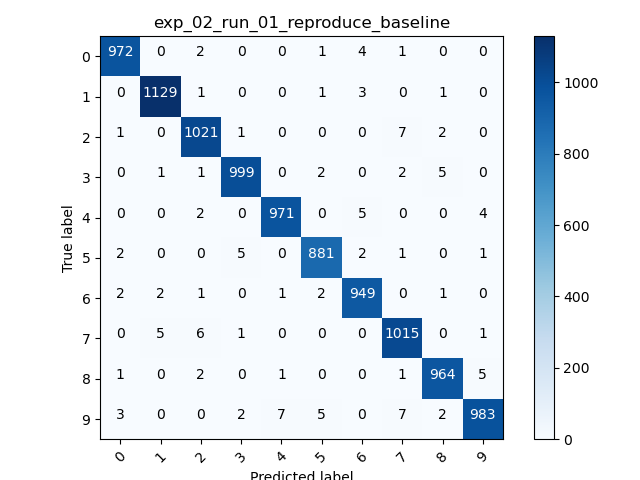

# spatial-transformer-experiments

## Setup

### conda environment install (recommended)

Using the provided YAML file:

    conda env create --file stn.cpu.yml

### conda environment install (alternative install)

    conda create --name stn.cpu
    conda activate stn.cpu
    conda install pytorch torchvision torchaudio cpuonly -c pytorch
    conda install matplotlib
    conda install -c conda-forge tensorboard
    conda install -c conda-forge kornia

### run experiments
    # activate the conda environment
    conda activate stn.cpu

    # runs all the experiments. The results are saved to the "experiments" directory
    python run_experiments.py

    # plot the accuracies of experiments
    python plot.py

    # the tensorboard logs can be seen with
    tensorboard --logdir=experiments

### sources

For the project i used the following sources

* This project is largely based on https://pytorch.org/tutorials/intermediate/spatial_transformer_tutorial.html
    * for models.py (especially the Net class)
    * for train.py
* coordconf.py is from https://github.com/walsvid/CoordConv/blob/master/coordconv.py 
* The confusion matrix is based on https://deeplizard.com/learn/video/0LhiS6yu2qQ

# Experiments

The experiments can be run using run_experiments.py. Several architectural changes are tested.
A plot comparing the Accuracies of all experiments can be found at the end

## exp_01_run_01_reproduce_baseline

Run baseline

## exp_02_run_01_reproduce_baseline

Runs the Net_CoordConv with the configuration that corresponds to Net (eg the baseline) but with a larger number of epochs because the loss seems not fully converged after 20 epochs. (blue corresponds to exp01, red to exp02)

## exp_03_run_01_bypass_localisation

Determine how big the influence of localisation network is. In order to do that the localistation network is bypassed

## exp_04_run_01_coordconf_classifier_bypass_localisation
    
Same bypass idea but this time the convolution layers of the classifier are replaced by coord conf layers  

## exp_05_run_01_coordconf_classifier

Use coordconf for the classifier

## exp_06_run_01_coordconf_localistation

Use coordconf for the localisation

## exp_07_run_01_coordconf_localistation_coordconf_classifier

    
Use coordconf for both the classifier and the localisation

## Accuracy Comparison

## Comparison Confusion Matrices

exp02           |  exp06
:-------------------------:|:-------------------------:
  |  

## Unfinished work

The Net_CoordConv_Homography class from models.py tries to replace the affine transformation with a homography. The intuition behind this is, that the a person who writes a digit is subject to a perspective transform, and not a affine transform, and therefore distorts the digit accordingly. Thus a homography might be more appropriate to correct this. It might also a interesting to extract an id from an image. However the training doesn't lead to nice transformations so far. A training run can be started by running python train.py. The results are saved to "experiments/test".

